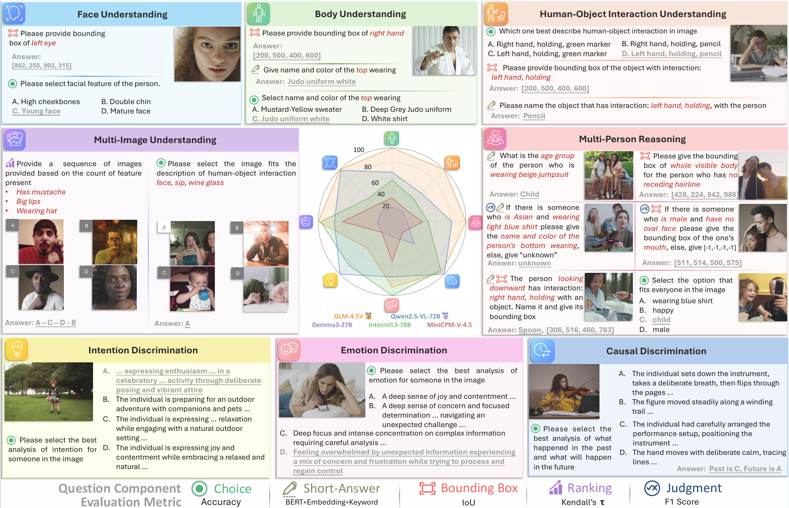

<p align="center">
  
</p>


Official repository for "Human-MME: A Holistic Evaluation Benchmark for Human-Centric Multimodal Large Language Models"

# Overview

Human-MME is a comprehensive evaluation benchmark designed to assess the capabilities of Multimodal Large Language Models (MLLMs) in human-centric scenarios. It encompasses a wide range of tasks.



# Running the Benchmark

To run the benchmark, follow these steps:

1. Clone the repository:
```bash
git clone https://github.com/Yuan-Hou/Human-MME.git
cd Human-MME
```

2. Install the required dependencies:
```bash
python -m venv .env
source .env/bin/activate
pip install -r requirements.txt
```

3. Prepare the datasets:

Download the datasets from [Human-MME_data.zip](https://huggingface.co/datasets/Yuanhou/Human-MME/blob/main/Human-MME_data.zip) and extract them into the root directory to maintain the following structure:
```
Human-MME/
├── final_qa/
├── final_labeling/
├── mllm_models/
├── benchmark.py
```

4. Implement your MLLM:

Implement your MLLM in `mllm_models/` directory by extending the `BaseModel` class. You should implement the `predict` method to handle the input and return the output. You can refer to the existing implementations for guidance.

Then, register your model in the `MODEL_NAME_MAP` dictionary in `benchmark.py`.

5. Run the benchmark:
```bash
python benchmark.py --model_name YourModelName
```

The default concurrency is set to 8. You can adjust it using the `--concurrency` flag.

If you get interrupted during the evaluation, you can resume it by adding the `--continuing` flag:
```bash
python benchmark.py --model_name YourModelName --continuing
```

6. Get the results:

After the evaluation is complete, the answers are saved in the `results/` directory with a json file named after your model in `results/result_YourModelName.json`. You can get the evaluation metrics by running:
```bash
python benchmark.py --calc_metrics results/result_YourModelName.json
```

# Leaderboard

To upload your results, please create a pull request with your result file in the `results/` directory. The results will be verified before being added to the leaderboard.

Bold indicates the best. Italics indicates the second place.

## Open-Source MLLMs

| Model              |       FU |       BU |       HU |      MIU |      MPR |       ID |       CD |       ED |     Avg. | 
| :----------------- | -------: | -------: | -------: | -------: | -------: | -------: | -------: | -------: | -------: |
| **GLM-4.5V**       | **61.6** | **77.4** | **82.5** |   *79.2* | **71.5** |     83.9 |   *85.4* |     66.6 | **76.0** |
| GLM-4.1V-9B        |     55.2 |   *74.1* |     69.5 |     71.8 |     64.3 |     82.7 | **76.0** |     58.8 |     69.1 | 
| *Qwen2.5-VL-72B*   |   *61.1* |     70.2 |   *70.6* |     75.4 |   *65.2* | **88.1** | **86.3** |     65.3 |   *72.8* |  
| Qwen2.5-VL-32B     |     56.2 |     73.3 |     65.3 |     70.7 |     58.2 |     82.9 |     81.1 |     64.9 |     69.1 | 
| Qwen2.5-VL-7B      |     49.4 |     68.4 |     61.4 |     61.0 |     46.3 |     84.1 |     72.1 |     60.9 |     63.0 | 
| Intern-S1          |     41.0 |     65.2 |     65.5 | **79.8** |     59.3 |     82.9 |     83.2 | **68.3** |     68.2 | 
| InternVL3-78B      |     43.4 |     67.9 |     67.2 |     78.6 |     54.6 |     86.7 |     84.7 |   *67.7* |     68.9 | 
| InternVL3.5-38B    |     44.6 |     72.6 |     64.6 |     75.0 |     53.8 |   *86.9* |     78.0 |     65.6 |     67.6 |
| Llama-4-Scout      |     27.3 |     50.6 |     49.4 |     48.9 |     33.9 |     66.5 |     57.1 |     50.4 |     48.0 | 
| LLaVA-NeXT-72B     |     38.0 |     66.8 |     65.1 |     54.8 |     47.2 |     77.0 |     70.5 |     54.6 |     59.3 | 
| Aya-vision-32B     |     30.9 |     57.2 |     57.1 |     67.9 |     42.8 |     76.2 |     71.8 |     57.4 |     57.7 | 
| Gemma3-27B         |     35.1 |     59.9 |     61.2 |     65.3 |     45.1 |     81.5 |     73.0 |     60.1 |     60.2 | 
| Kimi-VL-A3B        |     37.3 |     63.1 |     50.8 |     27.3 |     42.6 |     81.0 |     63.1 |     55.3 |     52.6 | 
| MiniCPM-V-4.5      |     38.9 |     62.6 |     62.4 |     73.5 |     52.1 |     81.5 |     67.8 |     63.3 |     62.8 | 
| Phi-4              |     29.5 |     48.1 |     48.6 |     39.6 |     29.6 |     62.9 |     38.1 |     46.4 |     42.9 | 

## Proprietary MLLMs

| Model              |       FU |       BU |       HU |      MIU |      MPR |       ID |       CD |       ED |     Avg. | 
| :----------------- | -------: | -------: | -------: | -------: | -------: | -------: | -------: | -------: | -------: |
| *GPT-4o*           |   *28.8* |   *58.8* |   *59.8* |   *74.7* |   *41.4* |   *79.2* |   *76.2* |   *52.7* |   *59.0* |     
| **Gemini-2.5-Pro** | **42.4** | **66.5** | **70.0** | **83.6** | **58.9** | **79.4** | **86.1** | **64.5** | **68.9** |   
